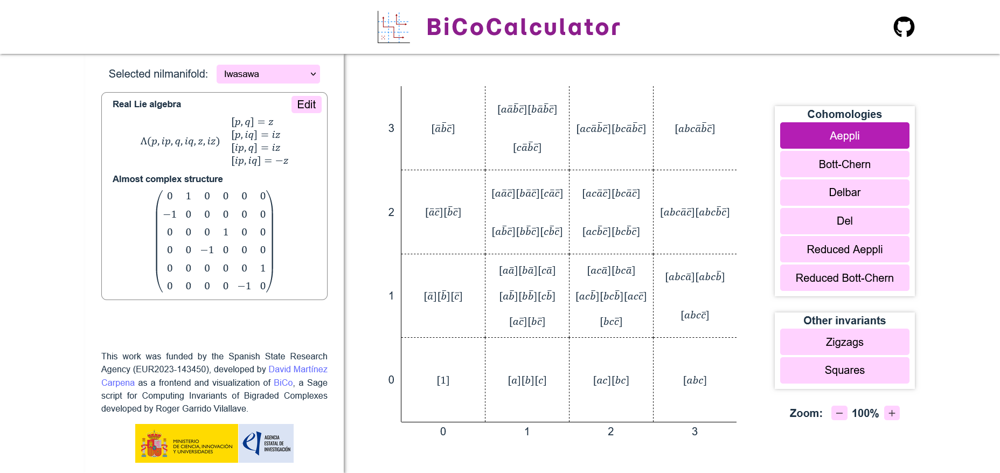

# BiCoApp<br><sub><sup>Web application for Computing Invariants of Bigraded Complexes</sup></sub>

This Sage script is aimed at computing invariants of Bigraded Complexes. It is based on the [BiCo](https://github.com/GeoTop-UB/BiCo) Sage script as the computing tool. Its main goals are the display of:

- Dolbeault, anti-Dolbeault, Bott-Chern and Aeppli cohomologies, and
- Zigzags and squares decomposition.

It has been funded by the project **Europa Excelencia "Homotopical Invariants of Almost Complex Manifolds" (EUR2023-143450), AEI, Spain**.



## Set up

The easy way to use the application is to install [Nix](https://nixos.org/). The backend of the application can be spawn with the command:

```shell
make backend
```

Once the backend is running, the frontend can be run on any other terminal using the following command:

```shell
make frontend
```

Then you can open [http://localhost:5173/](http://localhost:5173/) to see the web application.
